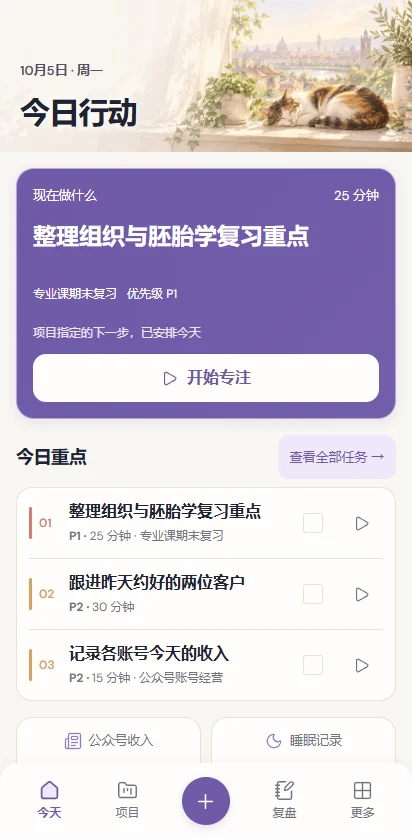

# 小松工作台 · 5 分钟上手

UI V3 Final · 2026-10-05。[打开工作台](https://harrison959.github.io/action-workbench/)。

先完成一条小行动，不必把全部模块填满。

## 1. 记下来 → Capture

临时想到“找组织学历年试题”，在 Today 快速记录，或中央 + → **快速记录到收件箱**。

电脑也可按 **Ctrl+K**（Mac **Cmd+K**），选择快速记录。先记一句话，不急着分类。

## 2. 变成行动 → Task / Project

去收件箱，点 **转为任务**，写成“下载组织学近三年试题”，今天，20 分钟，P1。

如果这件事属于一段长期工作，先新建“专业课期末复习”项目，完成结果写“梳理四门课程，做完两套模拟题”，再关联任务。

## 3. 选今天的重点 → Today

任务编辑器勾选 **放入当天 Top 3**，最多三项。Today 紫色区域给出下一步，下面是三个重点和有明确时间的日程。

晚上安排明天时，到 更多 → 提前安排，选日期与重点后确认。小结里写下明天想做什么，不会自动创建任务。

## 4. 开始一段 → Focus

点 **开始专注**进入后，再点 **开始 / 继续**。做完点 **结束并记录**，写结果；确实完成才勾选任务完成。

例如：“已下载三套题，明天整理上皮组织易错点。”没做完也可以留下下一步，不必强行勾完成。

## 5. 记真实发生的事 → Data

更多 → 数据，或 + → 记录数据。点 **+记录**，选择对应原表单。

- 睡眠填完整入睡／醒来日期时间与夜醒。
- 专业课填科目、内容、实际分钟与题目。
- 收入按每个公众号账号填金额，再保存当日收入。
- 体重、训练、英语、吉他、情绪按需记录。

**— 是没有记录，0 是明确为零。** 任务预估分钟不等于已经学习；Focus 完成也不自动生成学习记录。

## 6. 给今天收尾 → Daily Review

底栏复盘 → 每日，写三件事：推进了什么、卡在哪里、明天重点／下次调整。保存即可，几句话就够。

## 7. 确认下周重点 → Weekly Review

复盘 → 每周，选本周或上周。查看计划／完成、项目、学习、生活、收入／销售，再填人工复盘与下周最重要的一件事，可选最多三个重点项目。

周范围是北京时间周一到周日。缺失不补零；没有完整 Focus 历史时不会伪造周专注总时长。保存复盘不会自动改项目或生成任务。

## 8. 看少量值得注意的事实 → Insight

更多 → 值得注意，或 Weekly 的同名区域。看提示、记录覆盖与日期，展开依据；需要时打开对应页面。

这里是可解释规则，不是 AI，不替你下判断。“没记录到推进”不等于你没做。

## 最后确认两件事

**要双端同步：** 手机和电脑登录同一项目、同一账号，确认同步成功。未登录记录需要时在设置底部手动合并；录音仍只在原设备。

**要留备份：** 设置 → 导出记录，保存 JSON；录音另存。换手机／清缓存／卸载前先同步并备份。Android 晚间提醒需系统通知权限，网页关闭后无法可靠提醒。

完整闭环：**记下来 → 任务／项目 → 今日行动 → 专注 → 数据 → 每日复盘 → 每周复盘 → 值得注意**。

[手机说明与安装步骤](USER-GUIDE-MOBILE.md) · [网页版说明与快捷键](USER-GUIDE-WEB.md)
