# 小松工作台 · 手机端使用说明

适用：UI V3 Final，Android 应用及手机浏览器。更新日期：2026-10-05。

先看 [5 分钟上手](QUICK-START.md)。电脑操作见 [网页版说明](USER-GUIDE-WEB.md)。本说明的图片是实际程序截图；账号、客户和记录均为演示数据。

## 安装与打开

网页版地址：[小松工作台](https://harrison959.github.io/action-workbench/)。手机浏览器可以直接访问；“添加到主屏幕”是网页快捷方式，不能替代 Android 应用的锁屏通知。

Android 测试包从仓库的 [Android 构建](https://github.com/Harrison959/action-workbench/actions/workflows/android.yml)获取：

1. 登录 GitHub，打开最新 **main 分支且构建成功**的运行。核对运行的提交是你要安装的版本。
2. 在底部 Artifacts 下载 `action-debug-apk`，解压得到 `app-debug.apk`。
3. 把 APK 传到手机，用文件管理器打开；按 Android 提示授予该文件来源的安装权限。
4. 不需要使用迅雷。GitHub 下载的 ZIP 需要先解压，ZIP 本身不能安装。

这是测试包，不会自动升级。更新仍需安装新 APK。当前构建没有统一持久化签名；不同批次测试包可能不能覆盖安装。若系统提示签名冲突，先确认云同步完成并导出文字备份、另存录音，再处理旧应用。不要在备份之前卸载或清除应用数据。旧 Release 不一定包含最终 UI，应以构建对应的提交为准。

## 1. 核心逻辑：先决定，再执行，最后记录

把临时想法先记到收件箱；把要做的事变成任务；把长期结果放进项目。今天选最多三项重点，进入专注执行。真实发生的学习、睡眠、收入等在数据页记录；晚上每日复盘，周末每周复盘。

任务计划、实际生活记录、复盘是三个不同用途。创建“复习 30 分钟”的任务，不等于已经学习 30 分钟。完成 Focus 也不会替你生成专业课记录。

## 2. 首页 / 今日行动

紫色区域回答“现在做什么”，包含任务、项目、优先级、预计分钟和 **开始专注**。系统优先显示正在运行或暂停的有效专注；之后参考当天计划和合适的项目下一步，再选择未完成任务。

项目下一步不会把未来或未安排的任务强行插入今天。有明确 Top 3 时，普通项目任务不会压过它。完成当前任务后，这里会自动更新。

下面依次是今日重点、收入／睡眠轻摘要、进度、日程与快速记录。全部任务通过 **查看全部任务** 打开。

没有任务时，从 **新建任务** 开始即可；三个空槽位保留位置，不需要先填满。

## 3. 底部导航

| 入口 | 用途 |
| --- | --- |
| 今天 | 下一步、今日重点与安排 |
| 项目 | 长期目标、任务与项目笔记 |
| 中央 + | 创建与快速记录 |
| 复盘 | 每日小结、每周复盘 |
| 更多 | 任务、提前安排、数据、日历、收件箱、销售、设置等 |

数据页仍是“更多”下的页面；底栏不会为每项生活记录增加一个按钮。

## 4. 中央 +：五个常用入口

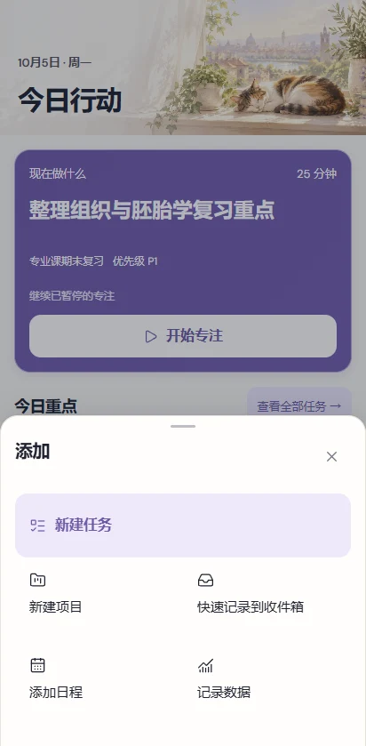

选择 **新建任务、新建项目、快速记录到收件箱、添加日程、记录数据**。记录数据会进入数据页，然后选择具体类别。没有另一套通用数字录入。

点击关闭或系统返回关闭面板；表单较长时可上下滚动，保存按钮在底部。

## 5. 创建与管理任务

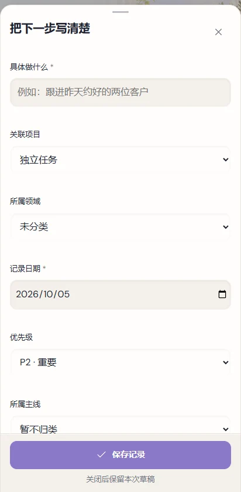

点 + → 新建任务。编辑器标题是 **把下一步写清楚**。填写 **具体做什么、日期、预估分钟**；按需要选择项目、领域、主线和优先级。

示例：“整理组织与胚胎学第一章易错点”，今天，25 分钟，P1，关联“期末复习项目”。相比“好好学习”，这个标题更容易开始和判断完成。

任务列表支持今天、即将到来、全部、已完成筛选及搜索。点任务文字打开详情；点勾选完成；播放图标进入专注。取消的任务不再计入正常计划统计。删除后可到设置的回收站恢复。

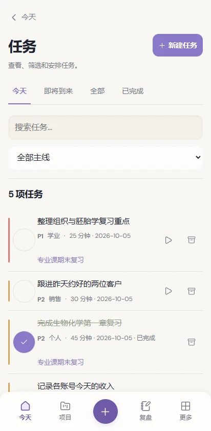

## 6. 优先级 Priority

| 等级 | 含义 | 小面积颜色 |
| --- | --- | --- |
| P1 | 必须完成 | 陶红 |
| P2 | 重要 | 琥珀 |
| P3 | 普通 | 鼠尾草绿 |
| P4 | 可选 | 灰色 |

任务同时显示 P1–P4 文字，颜色只是辅助。优先级不是截止时间，也不自动变更任务日期。

## 7. Top 3 与提前安排

创建或编辑任务时勾选 **放入当天 Top 3**。同一天最多三项；已完成重点仍保留为完成记录，想换重点可编辑原任务。

也可以到 更多 → **提前安排**，选日期，添加当天任务，勾选 1–3 项后确认。选择只是草稿，确认后才成为当天重点。修改后需再次确认。

使用场景：晚上先安排明天的“专业课复习、收入核对、客户跟进”；明天打开 Today 就能开始。

## 8. Focus / 专注

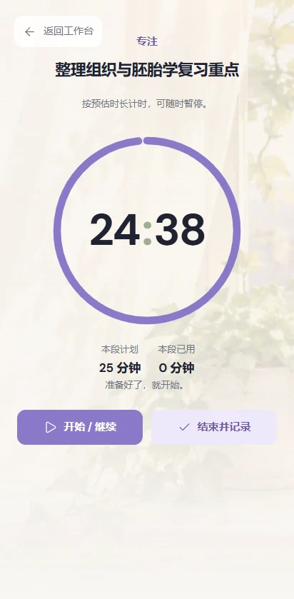

从任务进入专注后，先点 **开始 / 继续**，计时才运行。大数字是剩余时间，下方显示本段计划与已用分钟。可暂停，之后继续同一段。

点 **结束并记录**，写下完成结果／下一步；只有确实完成时才勾选 **这个任务已经完成**，保存后回到 Today。到时不会自动判定任务完成。

本段时间会记录到任务中；当前版本没有完整的逐次专注历史。每周复盘不能据此准确还原某周 Focus 总时长。

## 9. Projects / 项目

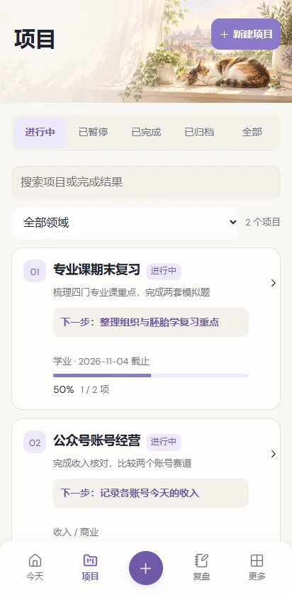

项目管理一个持续推进的结果，比如“完成四门专业课期末复习”。创建时填写名称和 **完成结果**，领域、开始／截止日期可按需要填写。

列表支持进行中、暂停、完成、归档及全部；可搜索项目。进度来自关联任务完成情况，不是随意填写的百分比。取消任务不计入正常进度。

## 10. Project Detail / 项目详情

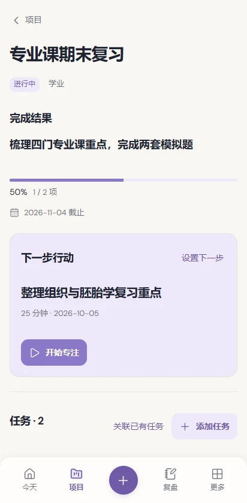

上方查看状态、完成结果、进度与真实截止日期。**下一步行动**区域可以指定一个项目任务，或直接开始专注。

**添加任务**为这个项目新建任务；**关联已有任务**选择独立任务。笔记留下实际推进与想法，历史区域可展开。编辑、暂停、完成、归档、移入回收站在底部。

归档用于收起项目；移入回收站用于删除项目。删除项目不会连带删除关联任务和笔记，恢复后可以继续查看。

## 11. Calendar / 日历

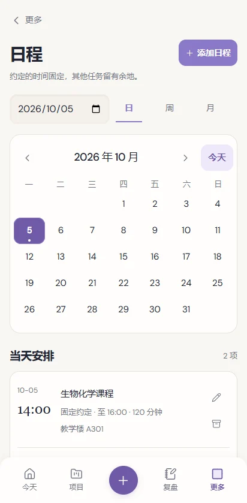

更多 → 日历。月历上方切换上月、下月或今天；日期点表示有日程，选中日突出显示。下面列出时间、名称、时长（有结束时间时）和编辑入口。

点 **添加日程**，填写名称、开始时间、可选结束时间和是否固定。课表可设固定；普通预约也可以记录。只有明确时间的事项出现在 Today 时间线，不会把所有任务挤进日历。

日／周／月范围筛选仍可用。日程使用北京时间，不要把一项无时间的待办当成整天日程。

## 12. Inbox / 收件箱

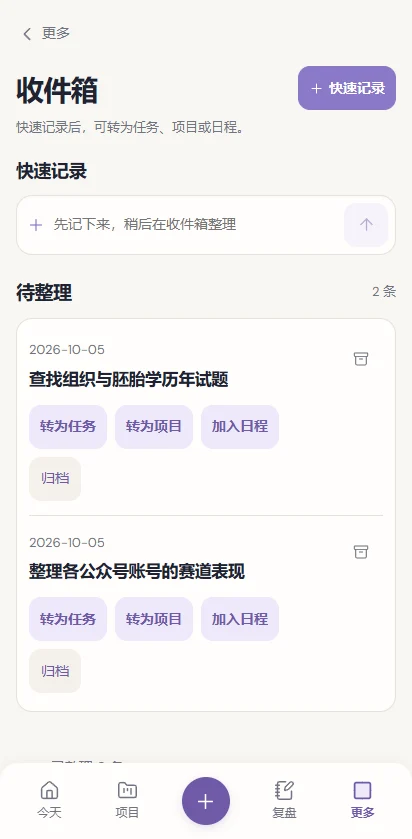

顶部快速记一句话，保存时无需分类。之后逐条 **转为任务、转为项目、转入日程**，或归档。任务／日程转换会打开正常编辑器，补齐信息后才保存。

示例：先记“找历年题”，晚上转成“下载组织学近三年试题”，设为明天 20 分钟任务。已经整理过的条目显示已转换／已归档，可在整理记录中查看。

## 13. Data / 数据

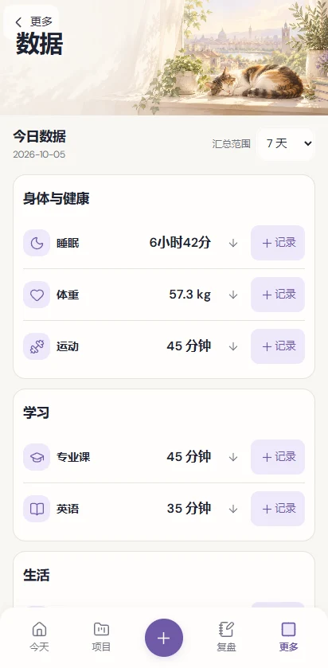

更多 → 数据，或 + → 记录数据。按身体与健康、学习、生活、收入分组查看当天数据。

点行内 **+记录**进入原业务录入；点指标打开原详情；展开箭头查看近 7／30 天历史、已记录天数和统计说明。

**— 表示没有有效记录，不是零。** 例如英语仅汇总观看与阅读填写的分钟，单词没有时长；睡眠按醒来日归属；公众号收入不含销售成交。

## 14. 公众号收入 Income

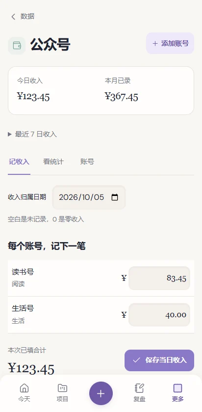

数据 → 公众号收入。先 **添加账号**，填写名称、赛道和开始日期；然后在 **记收入** 中选归属日期，分别填写账号金额，点 **保存当日收入**。

空白表示未记录，0 表示明确零收入。首屏显示今日收入、本月已录收入；最近 7 日收入可展开。**看统计**查看月内每日／年内每月曲线、账号和赛道对比；**账号**管理账号与赛道生效日期。

示例：读书号 83.45 元、生活号 40 元，当天合计 123.45 元。两端看到的是同一笔记录，不需要再次录入。

## 15. Sales / 销售

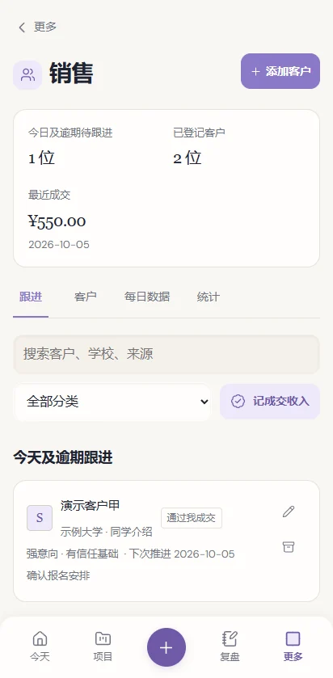

更多 → 销售。添加客户，记录学校、来源、首次接触、意向等级、沟通情况和下次推进日期。**跟进**显示今天及逾期到期客户；**客户**查看完整档案。

等级：S 强意向且有信任基础；A 有意向；B 一般／犹豫；C 无意向；D 已经学了；W 未成年。**D 不等于通过你成交**。

**每日数据**记申请／通过好友数量和进步／调整；通过可能来自前几天申请，不代表同批转化率。**记成交收入**选择真实成交客户、日期和金额。**统计**查看成交、销售收入和已登记客户样本。

公众号收入和销售收入分别展示，不混成来源不清的总额。

## 16. Sleep / 睡眠

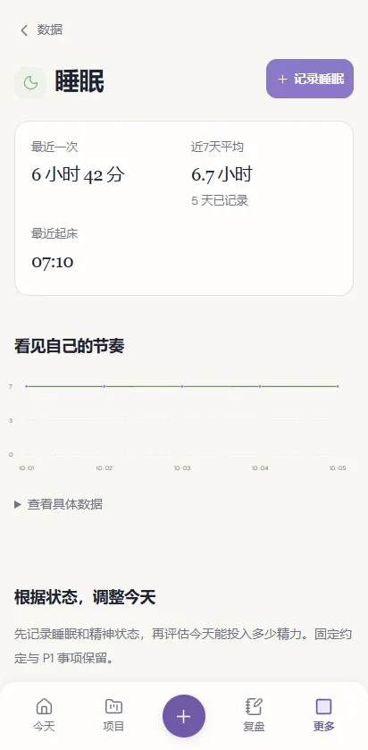

数据 → 睡眠 → **记录睡眠**。按醒来日期填写完整的上床、估计入睡、最终醒来、实际起床时间，以及夜醒次数／清醒分钟／精神状态。

跨午夜时填写真实日期。例如前一天 23:55 上床、当天 00:10 入睡、07:00 醒来，夜间清醒 8 分钟，睡眠时长是 6 小时 42 分。

同一天已有记录时请编辑原记录。首屏看最近睡眠、近七日平均、记录天数和起床时间。旧页面已有的任务调整需要你明确预览／确认，不会因为新界面而自动改计划；这些记录不提供医疗诊断。

## 17. Courses / 专业课

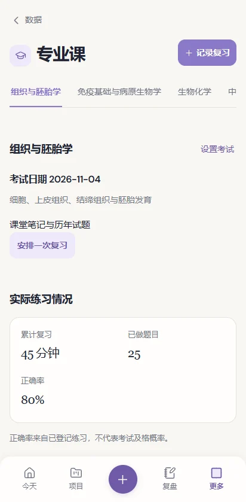

数据 → 专业课。切换组织与胚胎学、免疫基础与病原生物学、生物化学、中药学。**设置考试**填写考试日期、范围和资料；**记录复习**记章节、分钟、题数、正确题数、错题和下一步。

正确题数不能大于做题数。累计复习／正确率来自你填写的记录，不预测考试成绩。**安排一次复习**生成待办；完成学习后仍需记录实际内容。

## 18. English / 英语

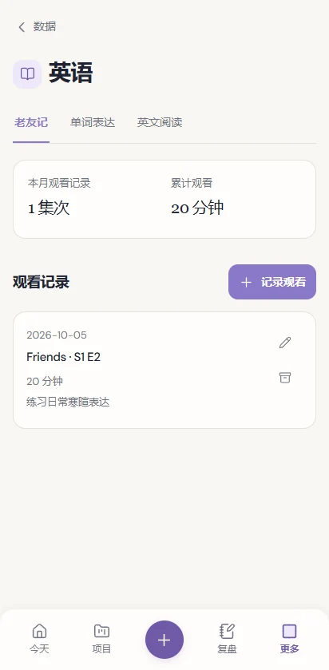

三个 Tab：

- **老友记**：记录季、集、观看分钟、是否重看和学到的表达。
- **单词表达**：词句、中文理解、例句、下次复习；“已复习，下次三天后”更新复习安排。
- **英文阅读**：先添加书籍，再记录页码／分钟；读完时填写完成日期。重读是另一次阅读周期。

数据页的英语时长只包含观看和阅读中填写的分钟。阅读记录次数不等于读完书籍数。

## 19. Fitness / 健身

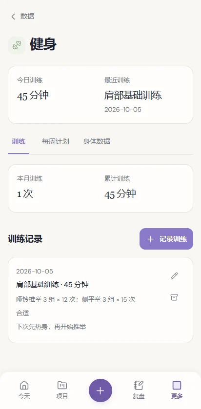

- **训练**：记录部位、时长、动作／组数／次数／重量、感受与调整。
- **每周计划**：安排训练与休息日；计划时间不会变成实际训练时间。
- **身体数据**：记录身高、体重、腰围、臂围、肩宽，选择指标查看趋势。

数据页“体重记录”与“运动记录”分别打开这两个原表单。旧测量同一天有多笔但没有测量时间时，页面会提示无法确认实际先后。

## 20. Guitar / 吉他

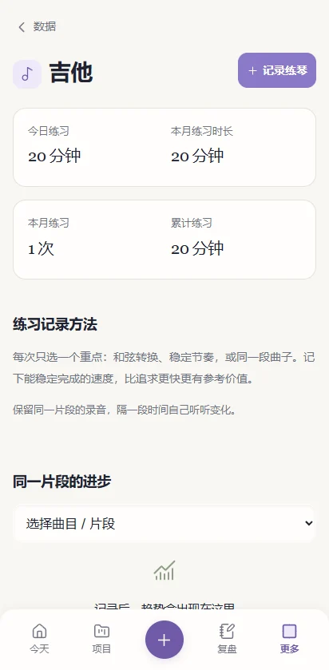

记录练习内容、曲目／片段、分钟、BPM、卡点和下次重点。首屏查看今日／本月练习；选择同一片段对比 BPM。

可为练习记录添加对比录音，单个文件最多 15MB。**录音只保存在添加它的设备**；文字可同步，另一台设备可能无法播放。云同步和 JSON 备份不包含录音文件，请另行保留原文件。

## 21. Emotion / 情绪

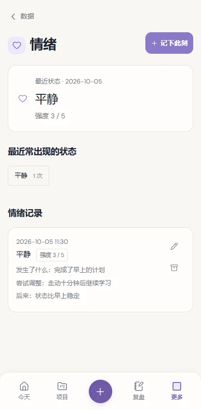

选状态，填 **强度 1–5**，按需要记录触发、反应、调整和结果。强度不是“心情好坏分”；开心 4 和焦虑 4 的方向不同。数据页仍显示状态，不丢掉情绪含义。

示例：疲惫，强度 3，触发“熬夜后下午发困”，调整“休息十分钟”，结果“能继续完成小任务”。无需给自己贴人格标签。

## 22. Daily Review / 每日复盘

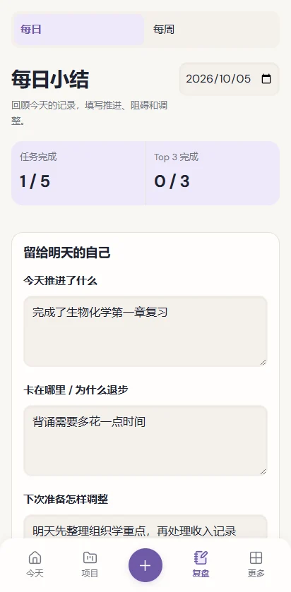

底栏复盘 → 每日。先看完成任务／Top 3 数量，再写 **今天推进了什么、卡在哪里 / 为什么退步、下次准备怎样调整**。第三项可写明天最重要的事；点 **保存小结**。

日期可切换，过去的小结仍可编辑。写在小结里不会自动生成明天任务；需要时再点 **安排明天**并确认计划。

## 23. Weekly Review / 每周复盘

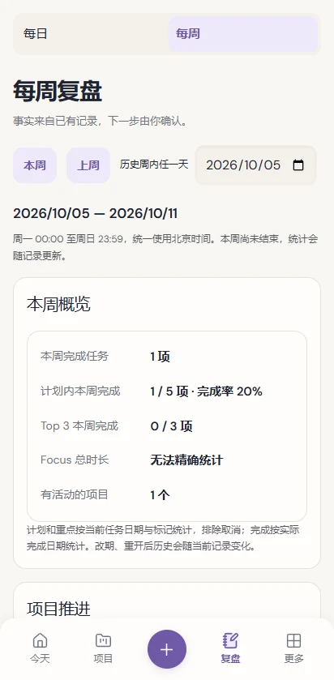

复盘 → 每周，选本周／上周或历史周。范围统一为北京时间周一到周日；本周未结束时会注明。

看任务、项目推进、学习与训练投入、睡眠／体重、公众号收入／销售；补充事实可展开。睡眠平均只用实际记录日，并显示如 3/7 天，不用没记录的天数补零。Focus 历史不足时明确显示无法精确统计。

填写推进、阻碍、应该停止／减少的事、下周最重要的一件事；可选最多三个重点项目，点 **保存周复盘与下周重点**。只保存你的复盘，不替你创建任务或修改项目。

## 24. 值得注意 Insights

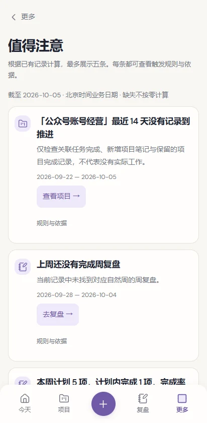

更多 → 值得注意，或每周复盘中的同名区域。最多显示少量满足规则／样本要求的事实，点行动按钮到对应页面。展开可看规则和数据来源。

“没有记录到推进”不等于没有工作；“睡眠记录覆盖少”不等于作息差。这里不使用 AI，不诊断、不预测、不自动改计划。缺少样本时不硬算趋势。

## 25. More / 更多

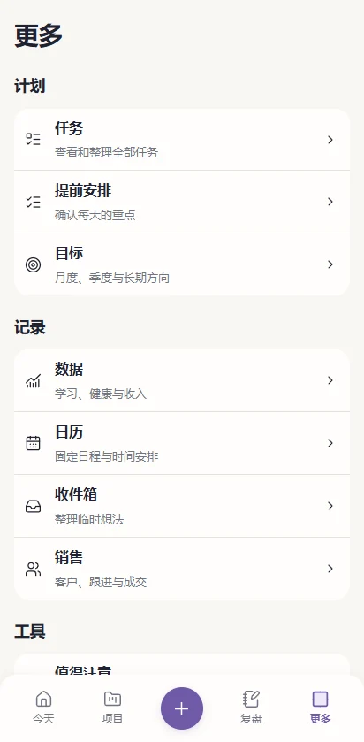

**计划**：任务、提前安排、目标。**记录**：数据、日历、收件箱、销售。**工具**：值得注意、已归档项目、设置与同步。低频操作在这里找，日常行动回 Today 即可。

## 26. Settings / 设置

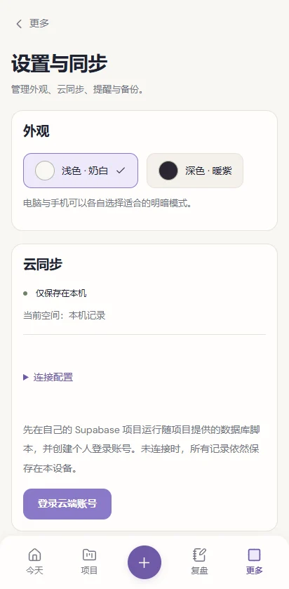

外观可选浅色奶白／深色暖紫；云同步显示当前空间与连接状态；提醒管理晚间通知；数据区导入／导出与恢复回收站；关于显示程序与 Web／Android 环境。

连接参数默认折叠。账号退出／本机记录合并位于页面底部登录后的 **账号操作**；既有高级工具也在底部，不是完成日常流程的前提。

## 27. 手机与电脑同步

两端必须使用 **同一个 Supabase 项目、同一个登录账号**。到设置登录，点立即同步，确认状态成功，再到另一端同步查看。

未登录的“本机记录”和登录后的个人空间分别保存。若登录后看不到刚才的本机记录，到 **账号操作 → 把本机记录合并到此账号**，再同步；不是记录被清空了。

发生冲突时，设置会同时展示本机／云端版本，由你选择保留哪一份。网络失败时本机记录仍保留，恢复联网后再次同步。公开的网址不会自动公开你的个人云端记录；共用设备则应留意登录状态。

## 28. 通知

Android 设置 → 晚间提醒，选时间 → 开启。允许系统通知权限；可运行通知测试。测试会在约 10 秒后提醒，点开到每日小结。

系统可能延迟提醒；应用提供精确提醒设置入口。锁屏默认只显示通用提醒，不显示收入／客户／情绪细节。网页版关闭后无法可靠发定时锁屏提醒。

本轮自动验收没有覆盖小米真机的省电、通知权限与锁屏表现，请安装后做一次通知测试。

## 29. 备份、导入、导出与恢复

设置 → **导出记录**，Android 会打开分享／保存界面。将 JSON 保存到能找到的位置，再定期复制到电脑。

**导入备份**选择 JSON，导入只合并尚未存在的记录，同 ID 的当前记录保留，不会用旧备份直接覆盖新内容。恢复删除的记录优先用 **回收站 → 恢复**，不要期待导入旧备份覆盖同 ID 的删除状态。

录音不在文字备份中。更换手机、卸载、清除数据之前，确认云同步成功、导出文字并保存录音原文件。

## 30. 离线使用

Android 应用自带页面资源，断网可操作本机记录；云同步需要网络。恢复联网后检查同步状态。

手机浏览器中，已打开页面的本机记录可离线保存；当前没有完整离线网页资源保证，断网刷新／首次打开可能失败。应用和浏览器的本地数据空间也不同，需要登录同一账号同步，不能靠同一台手机自动共享。

## 31. Android 返回与键盘

系统返回优先关闭弹层；二级页面返回上级；在今天／项目／复盘／更多主页面返回会最小化应用，不逐个倒退底栏。

表单关闭后原编辑器会保留草稿，但 **草稿不等于已保存记录**。重新打开确认保存。表单可滚动，键盘弹起时保存区仍应可达；真机系统键盘表现仍需实际检查。

外接键盘可用 Tab／Shift+Tab 移动焦点，Enter 操作按钮，Esc 关闭弹层。手机主要通过 + 操作，不依赖 Ctrl+K。

## 32. 常见问题与使用示例

**为什么数据页是 —？** 没有当天有效记录，或字段未填写。展开查看已记录天数；不要为了让界面有数值随便补零。

**为什么任务显示在项目里，却没成为 Today 下一步？** 查看任务日期、状态与当日 Top 3。指定项目下一步不是自动改期。

**为什么进入 Focus 后数字不动？** 还没有点“开始 / 继续”，或者已暂停。

**为什么同步后少了刚才的记录？** 先检查当前账号／项目和本机空间，再决定是否合并未登录记录。

**为什么新版 APK 安装失败？** 检查是否解压成 APK、是否选对版本，以及是否与旧测试包签名不同。处理旧应用前先备份。

**我只想用少量模块。** 可以先用 Today、公众号、销售、睡眠；英语／健身等按需记录，没用的页面不用填满。

**一个真实的一天：** 晚上确认明天三件事 → 早晨填睡眠 → Today 先复习 25 分钟 → 结束专注并记学习内容 → 下午按日程上课、按客户档案跟进 → 晚上记录各号收入和简短小结 → 周日确认下周最重要的结果。

---

界面随屏幕宽度调整，首屏截图未显示的内容可以向下滚动。 [网页版说明](USER-GUIDE-WEB.md) · [5 分钟上手](QUICK-START.md)
