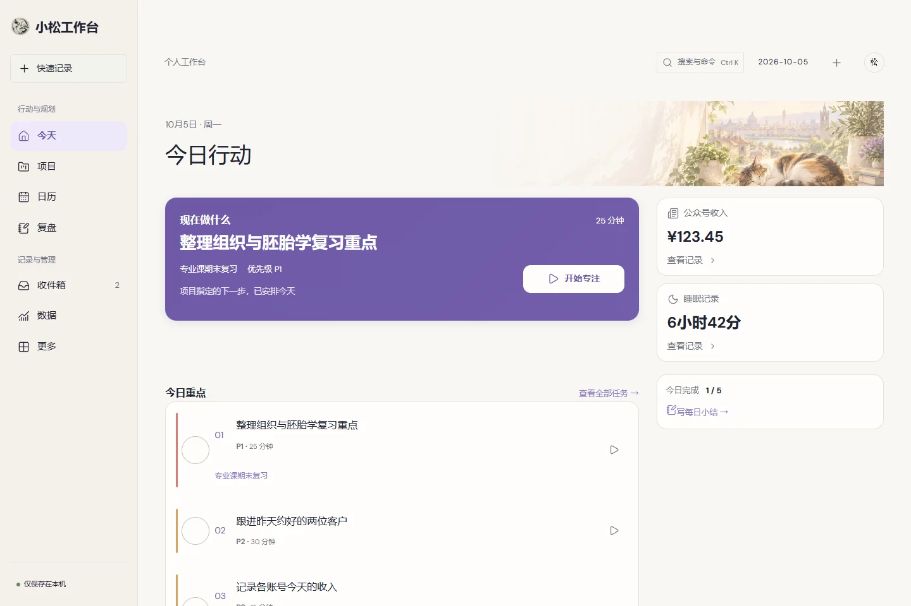
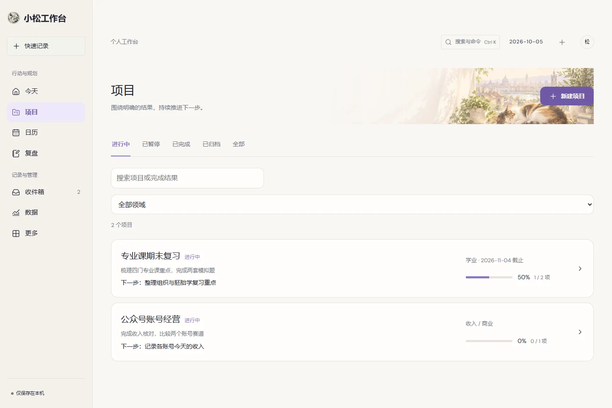
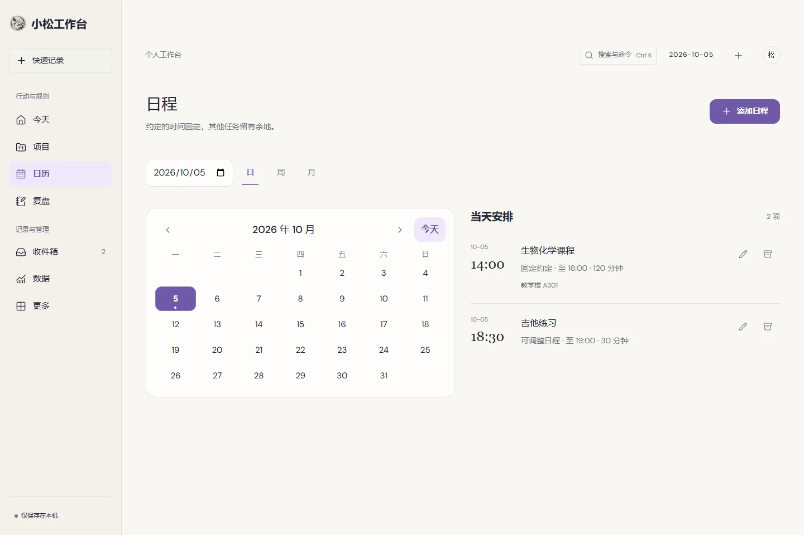
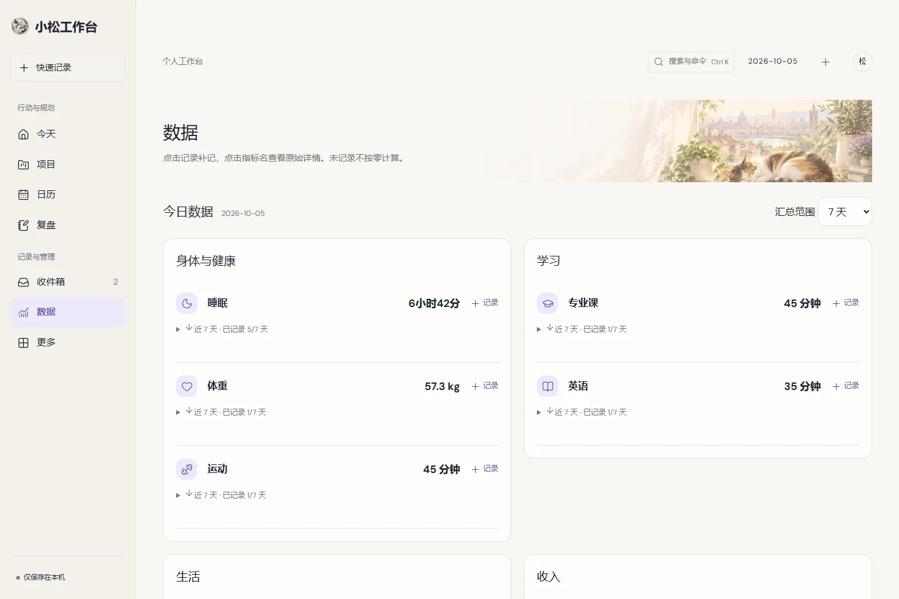
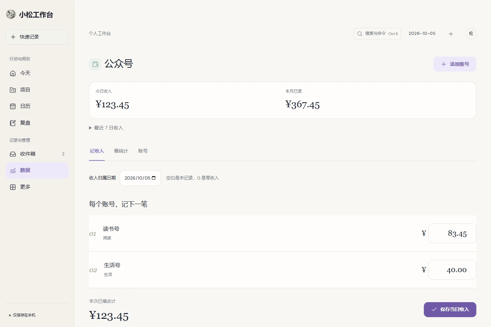
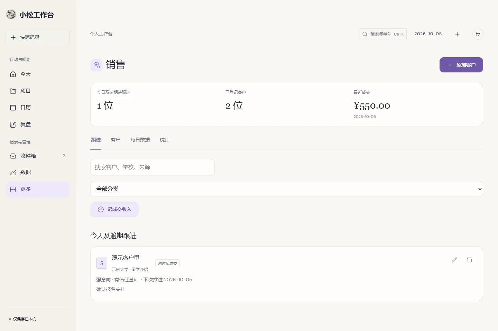
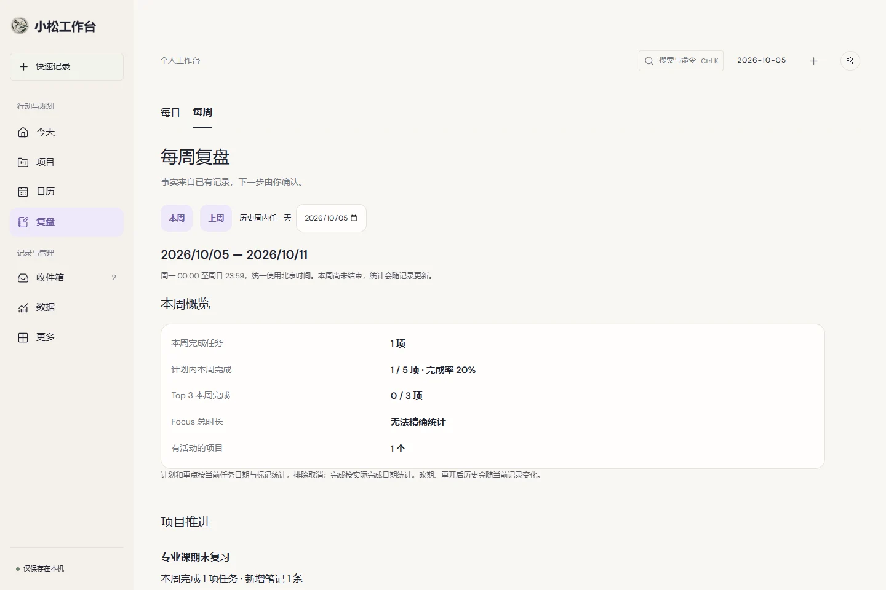
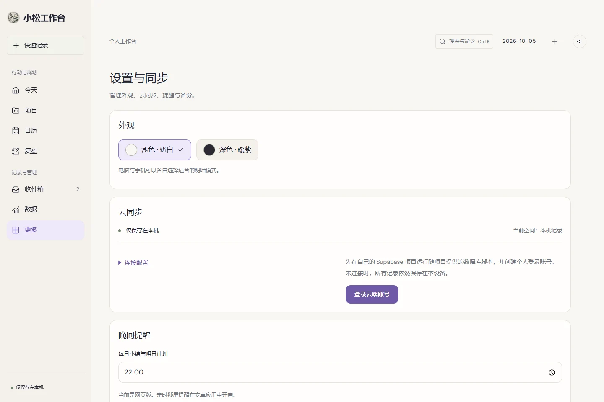

# 小松工作台 · 网页端使用说明

适用：UI V3 Final，桌面浏览器。更新日期：2026-10-05。

[5 分钟上手](QUICK-START.md) · [手机说明（含各业务页详解）](USER-GUIDE-MOBILE.md)。图片均为真实运行页面，使用独立演示数据。

## 1. 访问方式

打开 [小松工作台](https://harrison959.github.io/action-workbench/)。可收藏带 `#today` 等页面的链接，刷新仍留在对应页面。GitHub 仓库是源代码与文档入口，不是网站。

`localhost` 只指向当前设备的开发服务；手机请使用公开网址。网页版更新后刷新即可获得新资源，Android APK 需要另行更新。

## 2. 桌面导航

左侧依次为今天、项目、日历、复盘、收件箱、数据、更多。左上快速记录直接记入收件箱。顶部轻量工具栏显示日期、搜索命令入口和添加按钮。

任务／提前安排／目标从更多进入；生活学习收入从数据进入；销售和设置在更多。窗口较窄时会使用紧凑布局，手机使用底部导航。

## 3. Today / 今天

主栏先显示“现在做什么”、今日 Top 3 和时间线；辅助栏显示真实收入／睡眠、进度和快速记录。先开始一项行动，再看次级信息。

下一步优先延续有效 Focus；项目指定任务须适合今天，当天明确重点仍受保护。没有合适任务时先创建任务。点“查看全部任务”整理当天其他待办。

## 4. Tasks / 任务

更多 → 全部任务，或 Today → 查看全部任务。新建时写具体动作、日期、分钟、优先级，可选项目／领域／主线；勾选“放入当天 Top 3”。

P1 必须完成，P2 重要，P3 普通，P4 可选。最多三项重点不是最多三个任务；全部任务留在 Tasks。点标题编辑，勾选完成，播放按钮进入专注。

示例：为今天安排“核对两个公众号收入，15 分钟，P2”，为明天安排“整理组织学第一章，25 分钟，P1”。不要用没有完成标准的大标题占满重点。

## 5. Focus / 专注

从 Today、任务或项目的“开始专注”进入；点 **开始 / 继续**才运行计时。暂停可续接；结束时填写结果，实际完成才勾选完成任务。

刷新保留当前状态；不要同时在两端启动同一专注计时。当前仅有本段状态与任务累计时间，不支持准确的历史 session／每周 Focus 趋势。

## 6. Projects / 项目

项目是持续推进的结果，任务是下一步动作。创建项目填写名称和完成结果；可选领域和日期。列表按状态筛选／搜索，进度由关联任务计算。

进入详情查看 Outcome、Progress、真实截止日期、Next Action、任务、笔记与历史。可新增任务或关联独立任务，指定下一步。生命周期操作在底部；归档收起项目，删除进入回收站。

示例：“四门专业课期末复习” → “梳理组织学重点” → “做 25 道题并记录错题”。项目推进依据真实完成／笔记，不由视觉进度条推断。

## 7. Calendar / 日历

宽屏左侧月历、右侧所选范围的日程。月份箭头翻页，“今天”回当前日，点日期选择；圆点表示有日程。支持日／周／月筛选。

添加日程写开始时间和可选结束时间，固定课表可勾选固定。只安排真正有时间的事项；普通无时间任务仍留在 Tasks。已有日程可编辑／删除。

## 8. Inbox / 收件箱

先快速记录，不强制分类。整理时转成任务、项目、日程或归档；转换调用完整编辑器，保存成功后原条目标记已转换。

使用场景：工作中输入“周末对比账号赛道”，晚上再判断它是任务还是项目。可以在 Today、侧栏、Command Center 多处捕捉，但数据来自同一个收件箱。

## 9. Data / 数据

宽屏按两列领域分组查看睡眠、体重、训练、专业课、英语、吉他、情绪和公众号收入。点击 +记录调用对应原表单，保存后摘要自动更新。

展开指标看近 7／30 天历史和覆盖。缺失显示 —，不会自动补零。专业课与英语分项统计；单词没有分钟，英语时长只含剧集／阅读的有效分钟。

## 10. 各主线 Workstreams

| 主线 | 常用操作 | 记录重点 |
| --- | --- | --- |
| 公众号 | 添加账号、记收入、看统计 | 每个账号／赛道、日期、实际金额 |
| 销售 | 添加客户、跟进、记成交、每日数据 | 等级／学校／下次跟进，成交与收入单独确认 |
| 睡眠 | 记录睡眠、查看历史 | 完整日期时间、夜间清醒，按醒来日归属 |
| 专业课 | 切科目、设置考试、记录复习 | 章节、分钟、做题、正确数、错题 |
| 英语 | 老友记／单词表达／英文阅读 | 季集／词句／书籍页码，时长只来自观看与阅读 |
| 健身 | 训练／每周计划／身体数据 | 实际训练与计划分开，身体单位填写准确 |
| 吉他 | 记录练琴、片段 BPM、添加录音 | 分钟／曲目／卡点，录音仅原设备 |
| 情绪 | 记下此刻 | 状态、强度 1–5、触发、调整、结果 |

详细步骤见 [手机说明第 14–21 节](USER-GUIDE-MOBILE.md#14-公众号收入-income)。电脑业务表单使用同一套功能。

公众号金额按账号分别填，空白是没记录，0 是零收入；保存前看合计。月／年曲线与赛道生效日期仍保留。

销售等级 S/A/B/C/D/W 不是成交状态。实际成交要选择客户并记金额，不能把 D 类或今天待跟进数当成交数。

## 11. Review / 复盘

每日先看完成／Top 3，再填推进、阻碍和下次调整／明天重点。保存小结不会自动创建明天任务；需要时通过“安排明天”确认。

每周统一使用北京时间周一到周日，可选本周／上周／历史周。任务计划、实际完成、项目、时间、生活、收入／销售分项列出；只有真实记录日参与平均。

写人工复盘与下周重点，最多选三个项目。不会自动修改项目。当前 Focus 无完整历史时明确显示“无法准确统计”，不伪造周总量。

## 12. Insights / 值得注意

更多下的事实提示，以及 Weekly 的上下文提示。完整列表最多五条，有数据来源、日期／样本和对应行动入口；展开看规则。

这不是 AI 建议，也不推断原因。“没记录到”与“没发生”不同，缺少样本时不进行趋势比较。

## 13. More / 更多

进入任务、提前安排、目标、销售、值得注意、已归档项目、设置和封面。低频入口在这里集中，常用页直接使用侧栏或命令搜索。

## 14. Settings / 设置

外观浅色／深色可以按设备选择。云同步显示当前账号／空间；连接配置可展开。备份／回收站管理文字记录；关于区查看环境。

网页版不能可靠提供关闭页面后的定时锁屏通知；晚间提醒请使用 Android 应用。原账号退出和本机数据合并在底部。

## 15. Command Center / 命令与搜索

点顶部“搜索与命令”，或按 Ctrl/Cmd+K。输入命令名称、项目名称或未完成任务标题。

默认高频命令：新建任务、快速记录到收件箱、新建项目、开始／继续专注、添加日程。还可写每日小结，以及打开今天、项目、日历、复盘、收件箱、数据、更多。

搜索大小写不敏感，按命令、项目、未完成任务分组；项目打开详情，任务打开原编辑器。不做自然语言 AI 解析，也不搜索全部历史记录。

示例：Ctrl+K → 输入“复习” → ↓ 选择期末复习项目 → Enter；或 Ctrl+K → 输入“专注” → Enter，延续当前任务。

## 16. 快捷键

| 按键 | 操作 |
| --- | --- |
| Windows／Linux：Ctrl+K | 打开／关闭 Command Center |
| macOS：Cmd+K | 打开／关闭 Command Center |
| ↑／↓ | 命令结果中移动选择 |
| Enter | 执行当前命令／打开选中结果；单行快速记录提交 |
| Esc | 关闭命令面板或可关闭的弹层 |
| Tab／Shift+Tab | 在链接、输入框和按钮之间移动焦点 |
| Tab 组选中时 ←／→、Home／End | 切换分段选项 |

文本编辑和保存中的弹层不会被命令快捷键强行打断。没有设置 Space 为全局暂停，也没有给任意 Enter 绑定保存；多行文本中的 Enter 用于换行。

## 17. 云同步

在电脑和手机配置同一个项目，登录同一邮箱账号，检查“立即同步”成功。未经登录的本机数据独立保存，需要时手动合并到当前账号。

同步冲突会展示双方版本，选择本机或云端后再同步。数据不会因为 public 网站而自动公开；账号权限隔离仍需正确配置。录音文件不随文字同步。

共享电脑用完留意账号退出；浏览器隐私模式数据可能在关闭后清除。

## 18. 备份与恢复

设置 → 导出记录，浏览器下载 JSON；导入备份只合并新记录，同 ID 的现有记录保留。回收站用于恢复删除项。

录音文件不在 JSON 内，请另存。浏览器清理网站数据、切换浏览器、换设备之前，先同步并导出备份。登录后看不到本机记录时先检查当前空间，不要直接清缓存。

## 19. 离线与浏览器限制

已加载的页面可离线保存本机记录，网络恢复后同步。当前没有完整离线资源保证，断网刷新或首次加载可能失败。Android 应用自带页面资源，离线体验不同。

不同浏览器、不同网站地址、应用与网页各有独立本地空间；同一设备不代表自动共享。用同一账号的云同步连接它们。

后台页面可能被系统暂停；Focus 恢复显示时根据保存的状态校准，但当前不提供精确历史 session 报表。不要据此理解为专业计时或健康监测工具。

## 20. 常见问题与场景

**仓库能打开，为什么不是网站？** 使用本说明最上方 Pages 网址；仓库看代码，Pages 打开程序。

**更新后页面不对？** 先刷新；网络恢复后重新打开失败页。清网站数据之前先同步／导出，它会删除本机记录。

**Top 3 加不进去？** 当天已有三项，先编辑已有重点再添加。取消任务和完成任务的含义不同。

**明天重点写在复盘里，今天为什么没变？** 复盘记录想法；到提前安排为具体日期确认任务。

**记录后手机没出现？** 检查两端同一个项目／账号、是否同步成功、是否在同一业务日期。录音只能原设备访问。

**适合怎样分工？** 电脑做周计划、项目拆解、批量收入核对和长复盘；手机捕捉想法、查看下一步、填睡眠／身体和跟进客户。两端从同一真实记录继续工作。

---

[手机说明](USER-GUIDE-MOBILE.md) · [5 分钟上手](QUICK-START.md)
